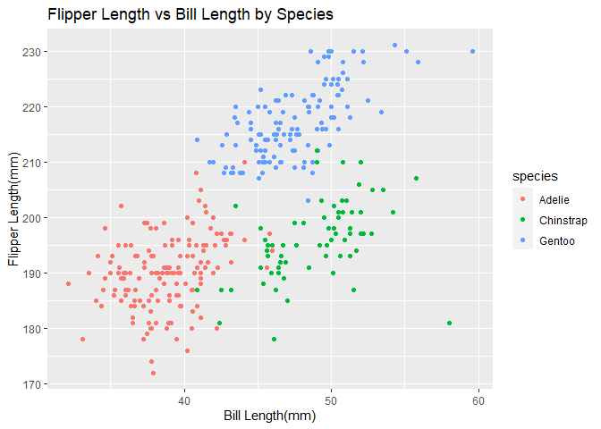

p8105_hw1_pz2334
================
Puyuan Zhang
2024-09-13

## Problem 1

### Dataset Information

``` r
# Load the penguins dataset and clean the dataset
library(palmerpenguins)
```

    ## Warning: package 'palmerpenguins' was built under R version 4.3.3

``` r
data1 <- penguins
data1 = janitor::clean_names(data1)
```

``` r
# Get more information about this dataset
name_var <- names(data1)
n_row <- nrow(data1)
n_col <- ncol(data1)
summary1 <- skimr::skim(data1)
mean_flip <- mean(data1$flipper_length_mm, na.rm = TRUE)
```

The data set has 344 observations and 8 variables. The variables are
species, island, bill_length_mm, bill_depth_mm, flipper_length_mm,
body_mass_g, sex, year. The mean flipper length is 200.9152047 mm.

In summary, penguins dataset contains 8 variables which 3 are factors
and the others are numeric. In the dataset, we can find that the total
observation is 344 but there might be some missing numbers in some of
the observations.

3 factors are Species, Island and Sex. Species: There are 3 types of
species. Island: There are 3 different locations which penguins are
found. Sex: There are 11 missing values. For the rest of observations,
there are 168 males and 165 females.

5 numeric variables contains information about the penguins.
bill_length_mm: The length of penguin’s bill in mm. bill_depth_mm: The
length of penguin’s bill in mm. flipper_length_mm: The length of
penguin’s flipper in mm. body mass: The weight of penguins in grams.

### Scatterplot

``` r
library(ggplot2)

ggplot(data = data1, aes(x = bill_length_mm, y = flipper_length_mm, color = species)) +
  geom_point() +
  labs(title = "Flipper Length vs Bill Length by Species",
       x = "Bill Length(mm)",
       y = "Flipper Length(mm)")
```

    ## Warning: Removed 2 rows containing missing values (`geom_point()`).

<!-- -->

``` r
ggsave("flipper_vs_bill_length.png")
```

    ## Saving 7 x 5 in image

    ## Warning: Removed 2 rows containing missing values (`geom_point()`).

## Problem 2

``` r
# Create data frame
set.seed(81051)

df <- data.frame(
  numeric_var = rnorm(10),
  logic_var = rnorm(10) > 0,
  char_var = c("A1", "A2", "A3", "A4", "A5", "A6", "A7", "A8", "A9", "A10"),
  factor_var = factor(rep(c("level1", "level2", "level3"), length = 10))
)
```

``` r
# Try to find the mean of each variables
library(tidyverse)
```

    ## ── Attaching core tidyverse packages ──────────────────────── tidyverse 2.0.0 ──
    ## ✔ dplyr     1.1.3     ✔ readr     2.1.4
    ## ✔ forcats   1.0.0     ✔ stringr   1.5.1
    ## ✔ lubridate 1.9.3     ✔ tibble    3.2.1
    ## ✔ purrr     1.0.2     ✔ tidyr     1.3.0
    ## ── Conflicts ────────────────────────────────────────── tidyverse_conflicts() ──
    ## ✖ dplyr::filter() masks stats::filter()
    ## ✖ dplyr::lag()    masks stats::lag()
    ## ℹ Use the conflicted package (<http://conflicted.r-lib.org/>) to force all conflicts to become errors

``` r
mean(df %>% pull(numeric_var))
mean(df %>% pull(logic_var))
mean(df %>% pull(char_var))
mean(df %>% pull(factor_var))
```

After running the code in this chunk, we can find out that the mean()
statement works for numeric data and logical data.

``` r
# Convert variable from one type to another
as.numeric(df$logic_var)
as.numeric(df$char_var)
as.numeric(df$factor_var)
```

We can change logical values and factor values to numeric values. As
logical values, TRUE becomes 1, and FALSE becomes 0. As factor values,
“level1” becomes 1, “level2” becomes 2, “level3” becomes 3. But
character values cannot convert to numeric, it returns NA when we try to
print it out.
